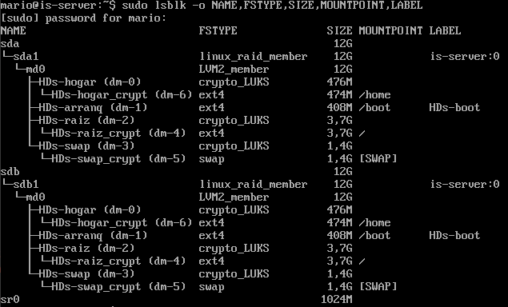
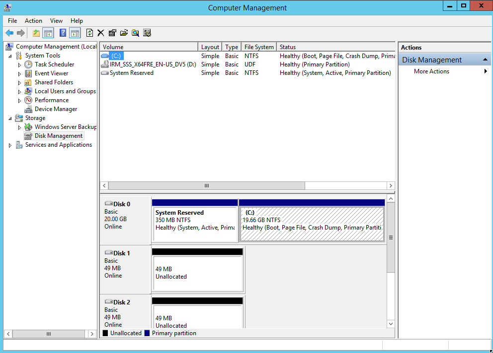
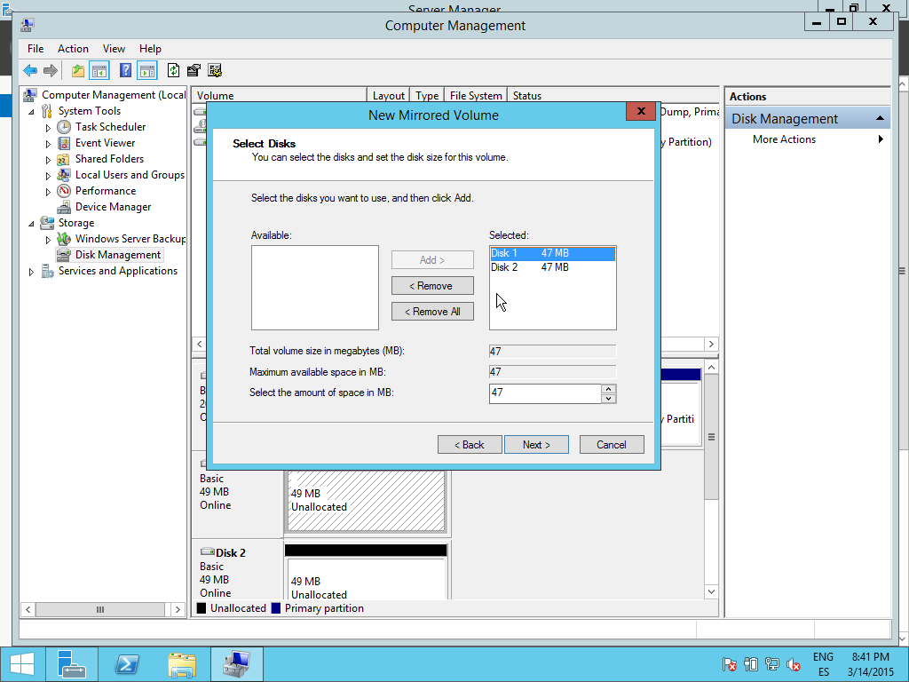
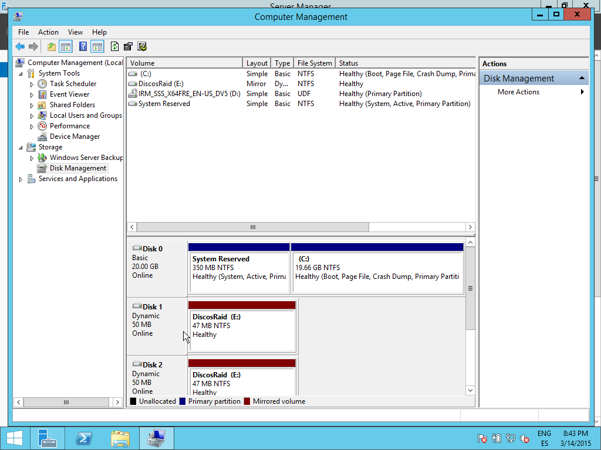
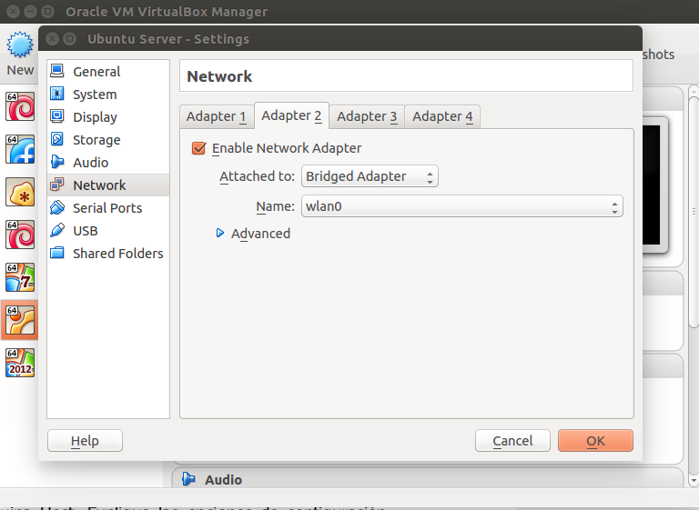
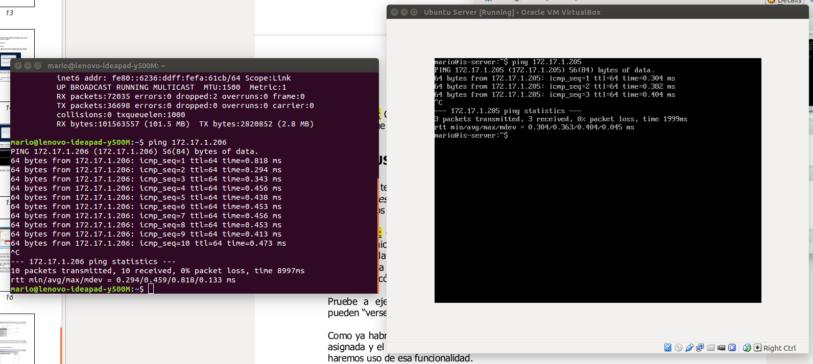

# Introducción

## Cuestión 1.
**¿Qué modos y tipos de “Virtualización Hardware” existen?**

Las técnicas más comunes de virtualización del hardware son las siguientes:
[^virt-sml] [^virt-wkp]

* **Virtualización hardware:** donde la máquina virtual simula los propios
  componentes de hardware, sobre los que se ejecuta el SO. Es muy costosa.
* **Virtualización por S.O.:** donde no se virtualiza el hardware. Se ejecuta una
  única instancia de kernel de SO huésped, y la virtualización se realiza sobre
  ella. Los distintos procesos se ejecutan aislados del resto. No hay pérdida de
  rendimiento.
* **Paravirtualización:** donde los SO guests se ejecutan sobre otro SO host y
  tienen que comunicarse con él para conseguir la virtualización. Hay buen
  rendimiento y permite usar varios sistemas operativos disintos.
* **Virtualización completa:** similar a la paravirtualización pero exigiendo
  que los SO guests usen la misma arquitectura hardware, y sin exigir que
  colaboren con con el huésped.

[^virt-sml]: Virtualización. *Smaldone.*  <https://blog.smaldone.com.ar/2008/09/20/virtualizacion-de-hardware/>
[^virt-wkp]: Virtualización. *Wikipedia.* <http://es.wikipedia.org/wiki/Virtualizaci%C3%B3n#Virtualizaci.C3.B3n_asistida_por_Hardware>

## Cuestión 2.
**¿Busque en Internet ofertas de servicios de, al menos, dos proveedores de
VPS (Virtual Private Server) y compare con el precio de alquiler del servicio, con el de
uso de servidores dedicados (administrados y no administrados) de características
similares?**

El proveedor **Hostalia** [^prov-hostalia] ofrece:

* Servidor dedicado: por 45€/mes.
* Servidor virtual: por 11.21€/mes.

[^prov-hostalia]: Hostalia. Servidores dedicados y virtuales. <http://www.hostalia.com/servidores/>

El proveedor **1&1** [^prov_1and1] ofrece:

* Servidor virtual: por 4.99€.
* Servidor dedicado: 19.99€.

[^prov_1and1]: 1&1. Servidores dedicados y virtuales. <http://www.1and1.es/servidores?__lf=Static&linkOrigin=&linkId=ct-btn-product-teaser-server>

## Cuestión 3.
**Busque dos soluciones de VMSW alternativas a las propuestas de VMWare
y Virtual Box. Explique sus principales características y diferencias con las soluciones
que vamos a emplear en clase.**

*QEMU* es un software emulador y virtualizador de máquinas virtuales. [^qemu]

*OpenVZ* es una tecnología de virtualización a nivel de sistema operativo
 Linux. Sobre ella se constuye *Virtuozzo*, un emulador de máquinas virtuales. [^openvz]

[^qemu]: QEMU <http://wiki.qemu.org/Main_Page>
[^openvz]: OpenVZ <http://openvz.org/Main_Page>

## Cuestión 4.
**Enumere las cinco innovaciones en Windows 2012 R2 respecto a 2008R2
que considere más importantes.**

* Permite servidores de mayor capacidad. Permite configurar hasta 320
  procesadores lógicos, 4 terabytes de memoria física y 1 terabyte de memoria
  virtual. [^12vs08plural]

[^12vs08plural]: Pluralsight. Windows Server 2012 R2 vs 2008 R2. <http://blog.pluralsight.com/server-2012-versus-server-2008>

## Cuestión 5.
**¿Qué empresa hay detrás de Ubuntu? ¿Qué otros productos/servicios
ofrece? ¿Qué es MAAS (<https://maas.ubuntu.com/>)?**

Canonical es la empresa que se encarga del desarrollo de Ubuntu. El resto de sus
servicios toman como base Ubuntu. [^canonical]

Entre sus otros productos se incluyen Landscape, Juju y MAAS. [^canonical-prod]

MAAS permite una capa de abstracción sobre los servidores físicos para
administrarlos de la misma forma elástica de la que se administrarían los
servidores en la nube. Así, permite manejar numerosos servidores de forma
sencilla. [^maas-about]

[^canonical]: Canonical. The company behind Ubuntu. <http://www.canonical.com/>
[^canonical-prod]: Canonical. Products. <http://www.canonical.com/products>
[^maas-about]: MAAS in brief. <http://maas.ubuntu.com/docs1.5/orientation.html#maas-in-brief>

## Cuestión 6.
**¿Qué relación guardan las distribuciones de Linux CentOS, Fedora y
RedHat Enterprise Linux? Comente las similitudes y diferencias que le parezcan más
significativas.**

*Fedora* es una distribución gratutita y libre escrita por la compañía RedHat. Se
centra en lanzar ediciones cada poco tiempo.

*RedHat* es una versión comercial (pero libre) desarrollada también por RedHat,
de la distribución.

*CentOS* es un clon comunitario de RedHat. Libre y gratuito. Clona las ediciones comerciales pero
no incluye el soporte y depende directamente de la comunidad.[^redhat-miessler] [^redhat-pydot]

[^redhat-miessler]: Daniel Miessler. Diferencias entre RedHat, CentOS y Fedora. <https://danielmiessler.com/study/fedora_redhat_centos/>
[^redhat-pydot]: Pydot. Diferencias entre RedHat, CentOS y Fedora. <http://www.pydot.com/documentacion/Diferencias-entre-Fedora-CentOS-y-Red-Hat>

## Cuestión 7.
**Busque indicadores de porcentaje de uso global o de cuota de mercado de
SO de Servidores. No olvide poner la fuente de donde saca la información y preste
atención a la fecha de ésta.**

Comprobando el SO de las páginas en el ránking de Alexa (compañía de Amazon) y
considerando las redirecciones como páginas únicas, tenemos que, para un estudio
que se actualiza diariamente: [^w3techs-met]

* Unix: 67.7%, de los cuales
    * Linux: 53%
    * BSD: 1%
    * Desconocido: 45%
* Windows: 32.2%
* OS X: 0.1%

[^w3techs-so]: W3Techs. Usage of SO for websites <http://w3techs.com/technologies/overview/operating_system/all>
[^w3techs-met]: W3Tehcs. Metodología <http://w3techs.com/technologies>

## Cuestión 8.
**a) ¿De qué es el acrónimo RAID? b) ¿Qué tipos de RAID hay? c) ¿Qué
diferencia hay entre RAID mediante SW y mediante HW?**

El acrónimo RAID procede de *Redundant Array of Independent Disks*. Los tipos de
RAID se estandarizan en varios tipos[^raid-wk], de los cuales, los más usados son:

* RAID 0: Reparte los datos entre dos o más discos de forma equitativa. Así
  consigue aumentar el rendimiento.
* RAID 1: Copia exactamente los datos de un disco en el otro. Así consigue más
  fiabilidad: sólo necesita que uno de los discos funcione.
* RAID 5: Reparte los datos divididos a nivel de bloques y además distribuye la
  información de paridad entre todos los discos del conjunto.

El *RAID por software* utiliza la capacidad computacional de la CPU para
ejecutar la aplicación que mantiene el sistema RAID.
Un *RAID por hardware*, por el contrario, tiene su propia memoria y procesador
para dedicarse a mantener el sistema RAID. Es un pequeño computador dedicado. [^raid-swhw]

[^raid-swhw]: Adaptec. Hardware vs. Software RAID. <http://www.adaptec.com/nr/rdonlyres/14b2fd84-f7a0-4ac5-a07a-214123ea3dd6/0/4423_sw_hwraid_10.pdf>
[^raid-wk]: RAID. Wikipedia. <http://es.wikipedia.org/wiki/RAID>

## Cuestión 9.
**a) ¿Qué es LVM? b)¿Qué ventaja tiene para un servidor de gama baja? c)
Si va a tener un servidor web, ¿le daría un tamaño grande o pequeño a /var?**

LVM (Logical Volume Manager) es un software gestor de volúmenes lógicos, usando
internamente la función `device-mapper` del núcleo Linux.

La ventaja que aporta es que permite usar un conjunto de discos como un gran
disco único, y usar particiones redimensionables dinámicamente que pueden ser
del tamaño de varios discos.

En los servidores web, el directorio base suele colocarse en `/var/www/`, por lo
que tendría sentido otorgar un tamaño más grande de lo habitual a `/var`. [^web-var]

[^lvm-arch]: ArchLinux Wiki. <https://wiki.archlinux.org/index.php/LVM>
[^web-var]: Unix Stack Exchange. <http://unix.stackexchange.com/questions/47436/why-is-the-root-directory-on-a-web-server-put-by-default-in-var-www>

## Cuestión 10.
**¿Es conveniente cifrar también el volumen que contiene el espacio para
swap? ¿Por qué no es posible cifrar el volumen en el que montaremos /boot?**

El volumen sobre el que montemos `/boot` no debería ser cifrado para permitir
que el gestor de arranque pudiera leer la partición.

El volumen sobre el que se monta `swap` sí debería estar cifrado, porque va a
contener datos de la memoria RAM, que podrían ser datos sensibles.

## Cuestión 11.
**¿Cuál es la diferencia más significativa entre ext3 y ext2?**

La diferencia crucial entre ambos es que `ext3` implementa un sistema de
registro por diario (journaling). [^ext2-se] Mantiene un log de los cambios que se le hacen
al sistema de archivos, y puede ser usado para recuperar el sistema tras errores
por corrupción del disco. [^ext3-jr]

[^ext3-jr]: Journaling filesystem <http://www.linuxtopia.org/HowToGuides/ext3JournalingFilesystem.html>
[^ext2-se]: Unix Stack Exchange. Differences between ext2 and ext3. <http://unix.stackexchange.com/questions/43589/besides-the-journal-what-are-the-differences-between-ext2-and-ext3>

## Cuestión 12.
**Muestre cómo ha quedado el disco particionado una vez el sistema está
instalado.**

Usando el comando `sudo lsblk -o NAME,FSTYPE,SIZE,MOUNTPOINT,LABEL`, obtenemos
las particiones acutales del disco, que podemos leer en la imagen (figura \ref{disco}). [^disc-ubuntu]

[^disc-ubuntu]: Ask Ubuntu. View partitions. <http://askubuntu.com/questions/182446/how-do-i-view-all-available-hdds-partitions>

## Cuestión 13.
**a) ¿Cómo ha hecho el disco 2 “arrancable”? ¿Qué hace el comando
grub-install?**

El comando `grub-install` puede usarse para hacer un disco arrancable.
Lo ejecutaremos sobre el segundo disco del RAID (en la instalación ya se nos
especificó que no se instalaría grub en el segundo disco). Así, podremos
arrancar en caso de fallo del primer disco.

[^grub-tuxradar]: Making a new hard drive bootable. <http://www.tuxradar.com/answers/265>

## Cuestión 14
**¿Cuál es la principal diferencia hay entre las versiones Standard y
Datacenter de Windows 2012?**

La versión Datacenter nos permite usar la licencia en un número ilimitado de
máquinas virtuales, mientras que la versión Standard nos limita a dos instancias
además del host.[^datacenter-itpro]

[^datacenter-itpro]: IT Pro. Differences between Standard and Datacenter editions. <http://windowsserver2012.itpro.co.uk/business-benefits/72/which-version-windows-server-2012-should-i-choose>

## Cuestión 15
**Continúe usted con el proceso de definición de RAID1 para los dos discos
de 50MiB que ha creado. Muestre el proceso con capturas de pantalla.**

Creamos los dos discos desde la máquina virtual y los reconocemos con el
administrador de discos de Windows Server (figura \ref{server2}). Creamos un *New Mirrored
Volume* desde el mismo administrador (figura \ref{server3}) y elegimos discos dinámicos. El
resultado puede verse en la imagen (figura \ref{server5}).

## Cuestión 16
**Configure la red virtual entre las máquinas Guest y Host de forma que
haya comunicación de red entre ellas y la máquina Guest pueda acceder a Internet
empleando la conexión de la máquina Host. Explique las opciones de configuración
posibles, y la elegida. Muestre con capturas de pantalla cómo queda la
configuración
de la red y cómo comprueba la conectividad entre máquinas y el acceso a
Internet.**

Configuramos la red con un adaptador puente entre ambas máquinas
[^red-geekstuff], con la configuración mostrada (figura \ref{red1}). Después nos conectamos
desde ambas máquinas para comprobar la conexión correcta (figura \ref{red5}).

Las opciones de conexión eran:

* **Network address translation**: El emulador tiene un sistema NAT que cambia
  la IP de los paquetes entrantes y salientes para adaptarla a la máquina
  huésped. Ambos tendrían la misma IP externamente.
* **Internal Networking**: Permite a las distintas máquinas invitadas conectarse
  internamente sin usar el puerto físico del huésped, por lo que es más
  seguro. Pero es interno y no conecta con el huésped.
* **Bridged networking**: Usa el puerto físico del huésped para comunicarse con
  la máquina invitada. Es el que usaremos porque, aunque es menos seguro (un
  sniffer en el puerto del host capturaría las comunicaciones), permite
  comunicar a ambos. [^red-geekstuff]

[^red-geekstuff]: Setup VirtualBox connections <http://www.thegeekstuff.com/2012/03/virtualbox-guest-additions/>
