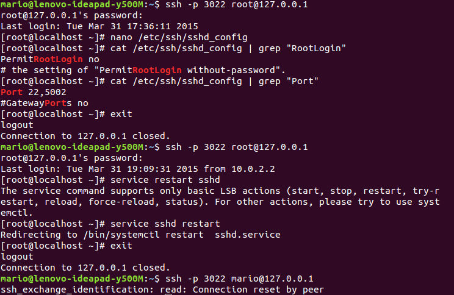
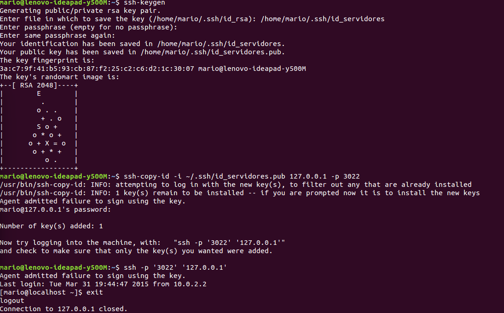
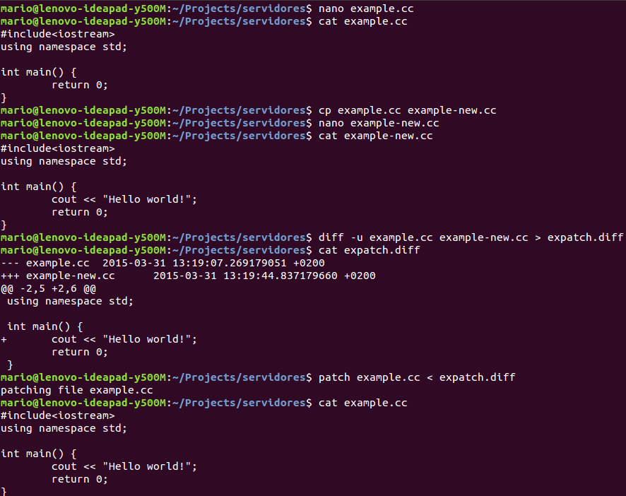

# Instalación de servicios y configuraciones

## Cuestión 1.
**Proporcione ejemplos de llamada a a yum para buscar, instalar y eliminar
paquetes**

Para buscar un paquete podemos usar el comando `yum list <nombre>`. Para
instalar usaremos `yum install` o `yum reinstall` en el caso de una
reinstalación. Para eliminar usamos `yum remove`. [^yum-man]

[^yum-man]: Linux man page. [Yellow Updater Modified](http://linux.die.net/man/8/yum)

## Cuestión 2.
**¿Qué ha de hacer para que yum pueda tener acceso a Internet a través
de un proxy? (Pistas: archivo de configuración en /etc, proxy:
stargate.ugr.es:3128). ¿Cómo añadimos un nuevo repositorio?**

Para usar un proxy, debe especificarse en `/etc/yum.conf`, escribiendo la URL
completa y el puerto TCP que se usará, como en el siguiente ejemplo:

``` bash
proxy=http://stargate.ugr.es:3128
```

Pueden añadirse las entradas `proxy-username` y `proxy-password` si son
necesarias. [^yum-proxy]

Para usar un repositorio nuevo, debemos incluir un archivo de repositorio en el
directorio `/etc/yum.repos.d/` con la forma: [^yum-repo]

``` bash
[repo]
name=Nombre del repo/ CentOS $releasever - $basearch
baseurl=http://sitio.com/centos/$releasever/$basearch/
enabled=1
gpgcheck=1
gpgkey=http://sitio.com/RPM-GPG-KEY.txt
```

[^yum-proxy]: Using yum with a proxy server. [CentOS Docs](https://www.centos.org/docs/5/html/yum/sn-yum-proxy-server.html).
[^yum-repo]: Using other software repositories. [CentOS Docs](https://www.centos.org/docs/5/html/yum/sn-using-repositories.html).x

## Cuestión 3.
**Proporcione ejemplos de comandos para buscar un paquete en un
repositorio y el correspondiente para instalarlo. (Pista: man apt-get ; man
apt-cache)**

Para buscar un paquete usamos: [^man-apt-cache]

> `apt-cache search <nombre del paquete>`

Para instalarlo usaremos: [^man-apt-get]

> `apt-get install <nombre del paquete>`

[^man-apt-cache]: Manual page `apt-cache(8)`. APT Team.
[^man-apt-get]: Menual page `apt-get(8)`. APT Team.

## Cuestión 4.
**Indique cómo debe modificar la configuración de apt para acceder a los
repositorios a través del proxy. ¿Cómo añadimos un nuevo repositorio?**

Puede indicarse esta configuración en el archivo `etc/apt/apt.conf`. Añadiendo
la siguiente línea en el archivo:

``` bash
 Acquire::http::Proxy "http://yourproxyaddress:proxyport";
```

Escribiendo dirección del proxy y el puerto correspondiente en
`http://yourproxyaddress:proxyport`. [^apt-proxy]

Para añadir un nuevo repositorio podemos editar el archivo
`etc/apt/sources.list`, que contiene los repositorios que usa el sistema en un
formato similar a este:

``` bash
 deb http://ppa.launchpad.net/reponame-daily/ppa/ubuntu jaunty main
 deb-src http://ppa.launchpad.net/reponame-daily/ppa/ubuntu jaunty main
```

Y además habrá que añadir manualmente la clave GPG con: [^askubuntu-ppa]

```bash
 sudo apt-key adv --keyserver keyserver.ubuntu.com --recv-keys 72D340A3
```

Otra forma de hacerlo es usar el comando `add-apt-repository`, que consiste en
un script para automatizar este proceso. Requiere instalar el paquete
`python-software-properties`. [^askubuntu-addapt]


[^apt-proxy]: <https://help.ubuntu.com/community/AptGet/Howto#Setting_up_apt-get_to_use_a_http-proxy>
[^askubuntu-ppa]: Ask Ubuntu. How to add a PPA on a server. <http://askubuntu.com/a/38029/175994>
[^askubuntu-addapt]: Ask Ubuntu. How to add a PPA on a server. <http://askubuntu.com/a/38035/175994>


## Cuestión 5.
**¿Qué diferencia hay entre telnet y ssh?**

Ambos son protocolos de aplicación para la comunicación orientados a texto.
La diferencia principal está en materia de seguridad. Por defecto, `telnet` no
encripta ninguno de los datos que se envían en la conexión; muchas de sus
implementaciones no aseguran la autenticación y se han descubierto varias
vulnerabilidades en ellas. Esto hizo que su uso decayera en favor de SSH, que
proporciona además encriptación y autenticación con clave pública. [^telnet-wiki]

Por otro lado, `telnet` suele usar el puerto 23, mientras que `ssh` usa el 22.

[^telnet-wiki]: Telnet. [Wikipedia](http://en.wikipedia.org/wiki/Telnet#Security).

## Cuestión 6.
**Modifique la configuración de SSH para que impida el acceso remoto del
usuario root y cambie el puerto por defecto. Indique las líneas modificadas en el
fichero de configuración y ponga de manifiesto el cambio mediante capturas de
pantallas en las que se aprecie el comportamiento antes y después de los cambios.
Tenga en cuenta que debe reiniciar el servicio para que tome los cambios.**

En el archivo `/etc/ssh/sshd_config` podremos configurar las opciones que
permite **ssh**. Cambiaremos las entradas `Port` [^ssh-lookup] y
`PermitRootLogin` [^ssh-login].

El proceso completo desde la terminal puede verse con los comandos en la
imagen (figure \ref{ssh1}).



[^ssh-lookup]: How to change default ssh port. [Linux Lookup](http://linuxlookup.com/howto/change_default_ssh_port).
[^ssh-login]: Disable root ssh login. [How to geek](http://www.howtogeek.com/howto/linux/security-tip-disable-root-ssh-login-on-linux/).

## Cuestión 7.
**Configure una instancia de Linux de forma que pueda acceder
remotamente (desde otra instancia o desde su anfitrión) sin introducir contraseña
(Pistas: ssh-keygen, ssh-copy-id). Documente el proceso que ha seguido indicando y
explicando los comandos utilizados así como posibles cambios en la configuración del
servicio. Muestre con capturas de pantalla que puede conectar al servidor ssh remoto
sin introducir contraseña.**

Configuramos el acceso para que sea posible desde el host, escribiendo una regla
de *port forwarding* desde Virtual Box. [^virtualbox-ssh]

Usamos luego el comando `ssh-keygen` para generar un par de claves
privada-pública y el comando `ssh-copy-id` para llevar la clave al servidor. El
proceso seguido puede observarse al completo en la imagen (figure \ref{ssh2}).



[^virtualbox-ssh]: How to ssh a VirtualBox guest externally? [Stack Overflow](http://stackoverflow.com/questions/5906441/how-to-ssh-to-a-virtualbox-guest-externally-through-a-host)


## Cuestión 8.
**En muchas ocasiones es necesario reiniciar un servicio para que tome los
cambios en su configuración. Indique los comandos que puede emplear en Ubuntu y
CentOS para hacerlo.**

Para reiniciar un servicio podemos usar uno de los siguientes comandos en
`CentOS`:

``` bash
 service <nombre>d restart
 /etc/init.d/<nombre>d restart
```

En `Ubuntu Server` podemos usar comandos similares, por ejemplo,
para `ssh`. [^restart-cibercity]

``` bash
 service ssh restart
 /etc/init.d/ssh restart
```

[^restart-cibercity]: Restart a SSH service. [Nixcraft](http://www.cyberciti.biz/faq/howto-restart-ssh/)


## Cuestión 9.
**Ponga de manifiesto el funcionamiento de PHP en Apache creando un
fichero php que presente su nombre y apellidos y accediéndolo con un navegador
web. Presente la captura de pantalla del resultado. Ponga de manifiesto el
funcionamiento de MySQL accediendo a la BBDDs por defecto (mysql) y consultando
los usuarios definidos en el sistema (select * from user). Documente con
capturas de pantalla el acceso y resultado de la consulta.**


## Cuestión 10.
**Para poner de manifiesto que el servidor está funcionando, acceda con
un navegador web a su propio equipo (localhost). Cree una página HTML básica con
su nombre y apellidos y publíquela en su servidor IIS. Muestre, con una captura
de pantalla, como accede a dicha página con el navegador web.**


## Cuestión 11.
**Escriba un breve contenido en un fichero de texto plano, cópielo y
modifíquelo ligeramente en un segundo archivo, por ejemplo, añadiendo un par de
líneas. Calcule las diferencias entre el fichero original y el modificado. Indique los
comandos necesarios para aplicar el parche así generado sobre el primer archivo y
obtener el segundo. Documente el proceso con capturas de pantalla de cada
paso.**

Usamos los comandos `diff` y `patch` para crear un parche desde las diferencias
de un código en C++ que modificamos. El proceso completo puede observarse en la
imagen (figura \ref{diff1}). Originalmente el código es:

``` cpp
 #include<iostream>
 using namespace std;

 int main() {
	 return 0;
 }
```

Y tras los cambios:

``` cpp
 #include<iostream>
 using namespace std;

 int main() {
     cout << "Hello world!";
	 return 0;
 }
```

Lo que nos generará un parche como el siguiente aplicando el comando `diff -u`.

``` diff
--- example.cc	2015-03-31 13:19:07.269179051 +0200
+++ example-new.cc	2015-03-31 13:19:44.837179660 +0200
@@ -2,5 +2,6 @@
 using namespace std;

 int main() {
+	cout << "Hello world!";
 	return 0;
 }
```

Finalmente aplicaremos el parche sobre el archivo antiguo usando
`patch example.cc < expatch.diff`.[^diff-nix]



[^diff-nix]: How to apply a Patch File. [Nixcraft](http://www.cyberciti.biz/faq/appy-patch-file-using-patch-command/).

## Cuestión 12.
**Realice la instalación de esta aplicación y pruebe a modificar algún
parámetro de algún servicio. Muestre las capturas de el proceso de modificación y
ponga de manifiesto el resultado.**
